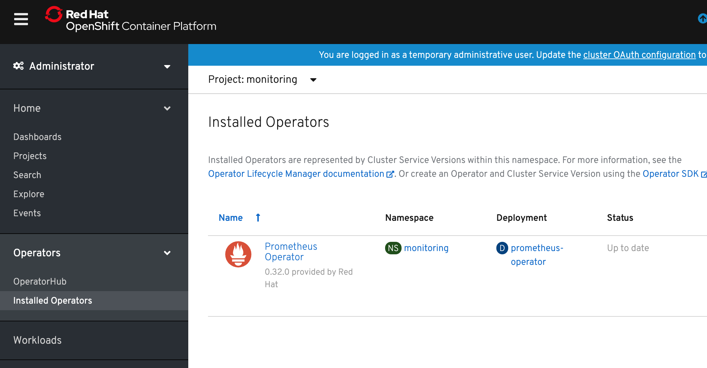
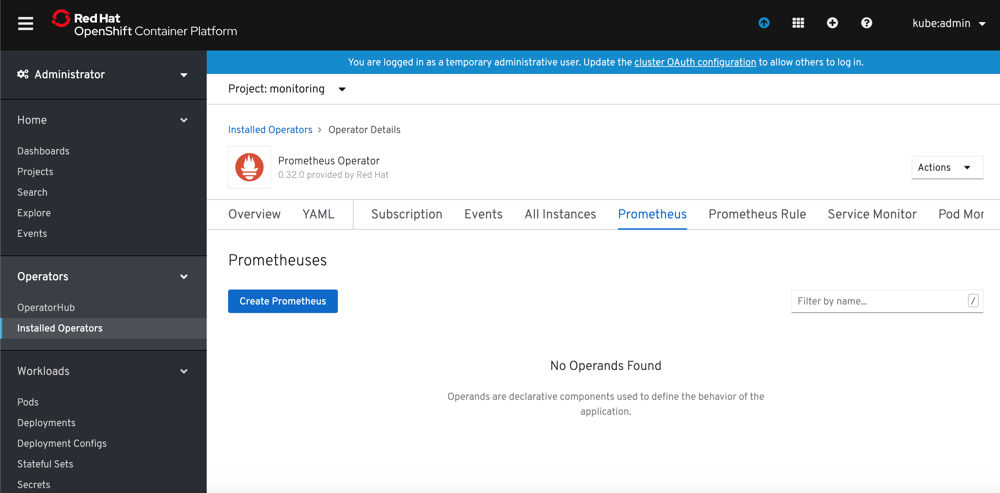
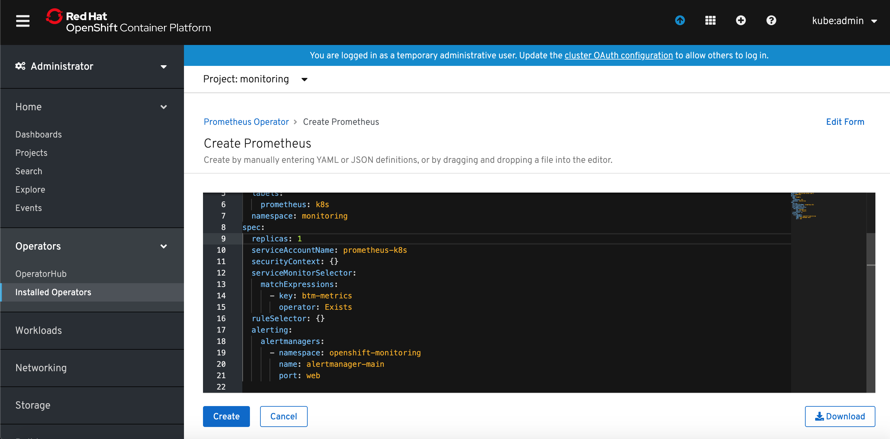
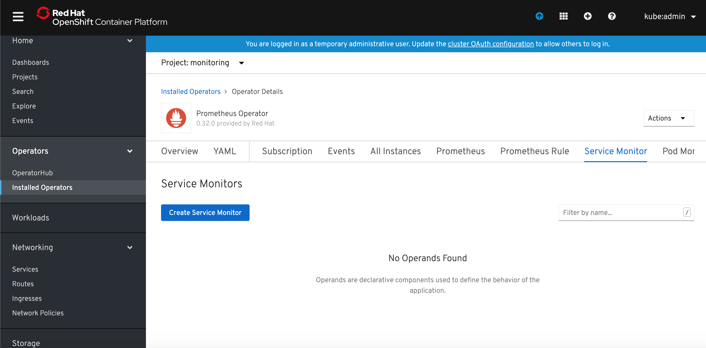
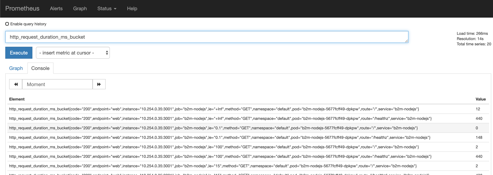
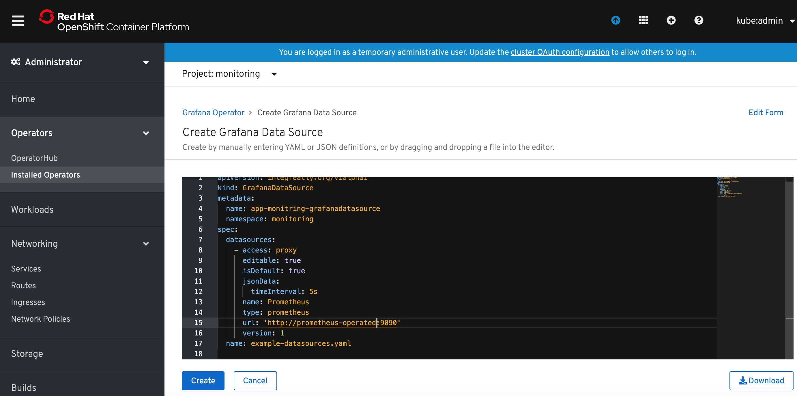
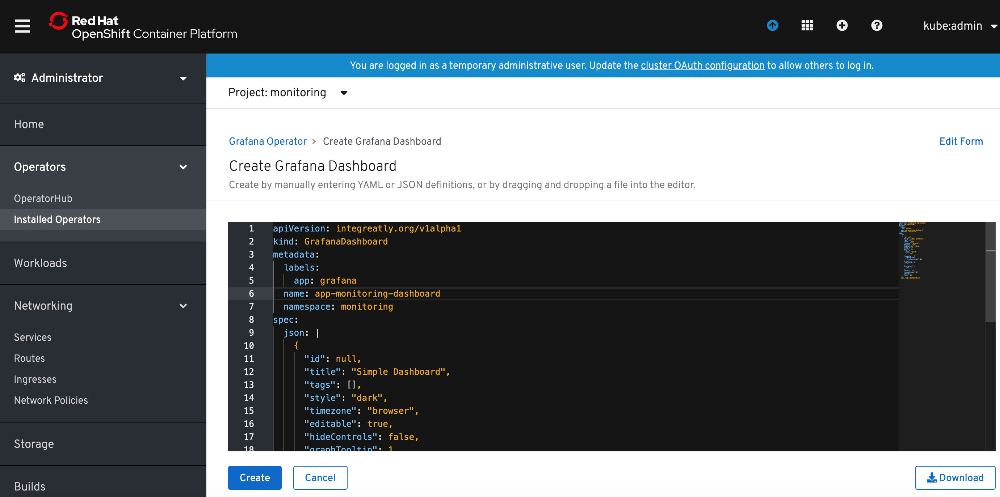
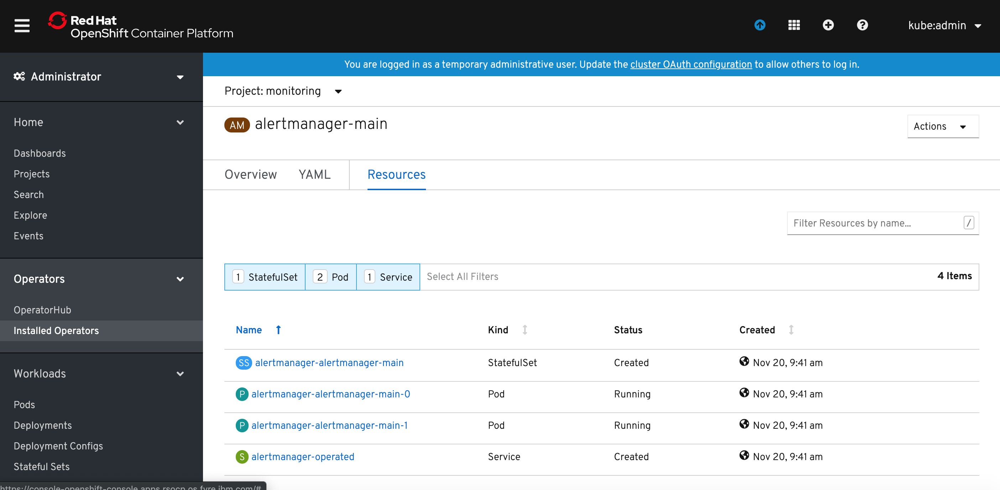
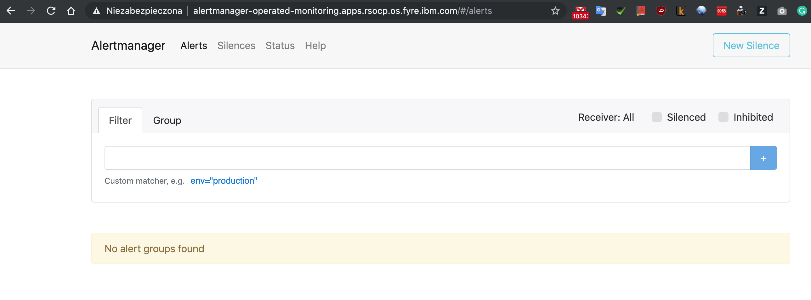

### Deploy an instrumented application
Use the following command and provided yaml file, to deploy sample Node.js microservice instrumented with Prometheus client library. 
```sh
oc create -f b2m-nodejs-ocp.yaml
```

Create route to expose this application externally:

```sh
oc create route edge  --service=b2m-nodejs -n default
```
Collect the app URL:

```sh
$ oc get routes -n default
NAME         HOST/PORT                                       PATH   SERVICES     PORT    TERMINATION   WILDCARD
b2m-nodejs   b2m-nodejs-default.apps.rsocp.os.fyre.ibm.com          b2m-nodejs   <all>   edge          None
```
and make sure it works:

```sh
$ curl -k https://b2m-nodejs-default.apps.rsocp.os.fyre.ibm.com

{"status":"ok","transactionTime":"353ms"}
```

Verify that it properly exposes metrics in Prometheus format:

```sh
$ curl -k https://b2m-nodejs-default.apps.rsocp.os.fyre.ibm.com/metrics

# HELP process_cpu_user_seconds_total Total user CPU time spent in seconds.
# TYPE process_cpu_user_seconds_total counter
process_cpu_user_seconds_total 0.23436700000000005 1573764470969

# HELP process_cpu_system_seconds_total Total system CPU time spent in seconds.
# TYPE process_cpu_system_seconds_total counter
process_cpu_system_seconds_total 0.069524 1573764470969

# HELP process_cpu_seconds_total Total user and system CPU time spent in seconds.
# TYPE process_cpu_seconds_total counter
process_cpu_seconds_total 0.3038910000000002 1573764470969
(...)
```

### Deploy Prometheus monitoring stack for applications.

1) Create a new project for the Prometheus monitoring stack for applications.


2) Select Operators -> Operator Hub and select `Prometheus Operator`. Click `Install`.


3) In the `Create Operator Subscription` window click `Subscribe`.
   


4) Wait until Prometheus Operator is deployed and click `Prometheus Operator` link.
 


5) Select `Prometheus` tab and click `Create Prometheus` button.



6) Modify default YAML template for Prometheus. I added `serviceMonitorSelector` definition which will instruct defined Prometheus instance to match `ServiceMonitors` with label `key=btm-metrics`. I also changed the Prometheus instance name to `app-monitor`.
   
```yaml
apiVersion: monitoring.coreos.com/v1
kind: Prometheus
metadata:
    name: app-monitor
  labels:
    prometheus: k8s
  namespace: monitoring
spec:
  replicas: 1
  serviceAccountName: prometheus-k8s
  securityContext: {}
  serviceMonitorSelector:
    matchExpressions:
      - key: btm-metrics
        operator: Exists
  ruleSelector: {}
  alerting:
    alertmanagers:
      - namespace: openshift-monitoring
        name: alertmanager-main
        port: web
```

Click `Create` button.



7) Select `Service Monitor` tab and click `Create Service Monitor`.



8) Modify default YAML template for ServiceMonitor. I added `namespaceSelector` definition to limit the scope to naespace `default` where my app has been deployed and modified `selector` that to look for services with label `name=b2m-nodejs`. I also changed the Service monitor name to `app-monitor`.


```yaml
apiVersion: monitoring.coreos.com/v1
kind: ServiceMonitor
metadata:
  labels:
    btm-metrics: b2m-nodejs
  name: app-monitor
  namespace: monitoring
spec:
  endpoints:
    - interval: 30s
      port: web
  namespaceSelector:
    matchNames:
      - default
  selector:
    matchLabels:
      name: b2m-nodejs
```


9) Grant `view` cluster role to the Service Account created by the operator and used by Prometheus.

```sh
oc adm policy add-cluster-role-to-user view system:serviceaccount:monitoring:prometheus-k8s
```

or, if you want to limit it to the application namespace, add `view` role only to the app namespace:

```sh
oc adm policy add-role-to-user view system:serviceaccount:monitoring:prometheus-k8s -n default
```


10) Expose app monitoring Prometheus route:

```sh
oc expose svc/prometheus-operated -n monitoring
```

11) Collect the app monitoring Prometheus URL:

```sh
$ oc get routes -n monitoring
NAME                  HOST/PORT                                                   PATH   SERVICES              PORT   TERMINATION   WILDCARD
prometheus-operated   prometheus-operated-monitoring.apps.rsocp.os.fyre.ibm.com          prometheus-operated   web                  None
```

12) Verify that app monitoring Prometheus can scrape `b2m-nodejs` app. Access the Prometheus URL via browser and select Status -> Targets.


13) Verify that instrumented metrics are collected:
    


### Deploy Grafana Operator
1) Deploy the Grafana Operator from OperatorHub using the same steps as for Prometheus Operator.
Now you should see it in `Operators -> Installed Operators`.


2) Click on the Grafana Operator link, select `Grafana` tab and click `Create Grafana`.


3) Modify the name of the Grafana instance to something meaningful. I named it `app-monitoring-grafana`. Click `Create` button. Modify also the admin user name and password.

4) Return to the Grafana Operator details, select `Grafana Data Source` and click `Create Grafana Data Source` button. Rename the `name:` to something meaningful (I named it `app-monitoring-grafana-datasource`) and modify spec.datasources.url to your app monitoring prometheus instance. In my case it was `http://prometheus-operated:9090`. 



The prometheus hostname is the same as the app monitoring prometheus service name. You can find it in `Networking->Services` (filtered by the project where app monitoring prometheus has been deployed).

5) Make the route for Grafana has been created in `Networking->Routes` (project `monitoring`). If it is not listed, create it with command:

```sh
oc create route edge  --service=grafana-service -n monitoring
```
Access the Grafana console URL and logon to Grafana.
Verify the Prometheus datasource has been created and can connect to app monitoring Prometheus.

Create sample monitoring dashboard and copy dashboard JSON definition or use the one provided in this repository: `app-monitoring-dashboard.json`.

6) Return to the Grafana Operator details in OpenShift console, select `Grafana Dashboard` and click `Create Grafana Dashboard` button. Rename the `metadata.name:` to something meaningful.



and copy dashboard JSON definition to `spec.json`. You can also use provided example Grafana Dashboard yaml provided with this repo: `grafanadashboard-app-monitoring-dashboard.json`.

7) Verify that Grafana dashboard has been provisioned:


### Deploy Alertmanager (optional)

Application monitoring Prometheus Operator can fire alerts to existing/default Alertmanager instance located in `openshift-monitoring`. If you want to use it, the only thing you need to configure are alerting rules for your application, because Prometheus resource has been already preconfigured to send to platform monitoring Alertmanager (as you can see in the Prometheus resource YAML):

```yaml
spec:
  alerting:
    alertmanagers:
      - name: alertmanager-main
        namespace: openshift-monitoring
        port: web
```


You can also configure separate Alertmanager cluster using app monitoring Prometheus Operator.

The Prometheus Operator introduces an `Alertmanager` resource, which allows users to declaratively describe an Alertmanager cluster. To successfully deploy an Alertmanager cluster, it is important to understand the contract between Prometheus and Alertmanager.

The Alertmanager may be used to:

- Deduplicate alerts fired by Prometheus
- Silence alerts
- Route and send grouped notifications via providers (PagerDuty, OpsGenie, Slack, Netcool Message Bus Probe, etc.)

Prometheus' configuration also includes "rule files", which contain the alerting rules. When an alerting rule triggers, it fires that alert against all Alertmanager instances, on every rule evaluation interval. The Alertmanager instances communicate to each other which notifications have already been sent out.

In OpenShift console go to Installed Operators, click on Prometheus Operator instance, scroll tabs to Alertmanager tab.
Click `Create Alertmanager` button.


Specify the desired number of replicas and click `Create` button.


Now you can list the resources of Alertmanager and you should see Alertmanager pods in `Pending` state. This is because Alertmanager can't run wthout a configuration file.

The Alertmanager instances will not be able to start up, unless a valid configuration is given. The following example configuration sends notifications against a non-existent webhook, allowing the Alertmanager to start up, without issuing any notifications. For more information on configuring Alertmanager, see the [Prometheus Alerting Configuration](https://prometheus.io/docs/alerting/configuration/) document.
```yaml
global:
  resolve_timeout: 5m
route:
  group_by: ['job']
  group_wait: 30s
  group_interval: 5m
  repeat_interval: 12h
  receiver: 'webhook'
receivers:
- name: 'webhook'
  webhook_configs:
  - url: 'http://alertmanagerwh:30500/'
```

Save the above Alertmanager config in a file called alertmanager.yaml and create a secret from it using `oc`.

```sh
oc create secret generic alertmanager-alertmanager-main --from-file=alertmanager.yaml
```

Alertmanager pods should change the status to `Running`.



The service `alertmanager-operated` has been created automatically and if you want to externally expose Alertmanaget UI, create the route using the followng command:

```sh
$ oc create route edge  --service=alertmanager-operated -n monitoring
```

Collect the Alertmanager URL:

```sh
 oc get routes alertmanager-operated
NAME                    HOST/PORT                                                     PATH   SERVICES                PORT   TERMINATION   WILDCARD
alertmanager-operated   alertmanager-operated-monitoring.apps.rsocp.os.fyre.ibm.com          alertmanager-operated   web    edge          None
```

and verify using web browser:




This Alertmanager cluster is now fully functional and highly available, but no alerts are fired against it. Configure Prometheus resource to fire alerts to our Alertmanager cluster.

Edit Prometheus resource `spec.alerting` section:

```yaml
spec:
  alerting:
    alertmanagers:
      - name: alertmanager-operated
        namespace: monitoring
        port: web
```
and click `Save`.

### Configure Alerting Rules

Alerting Rules for application monitoring can be created from the `Operator Details` view of our Prometheus Operator instance. Click on the `Prometheus Rule` tab and then on `Create Prometheus Rule` button.


Specify alert rule definition in the YAML file. You can use provided ExampleAlert.yaml as an example.


After short time verify that your alert(s) have been activated using  Prometheus UI:

