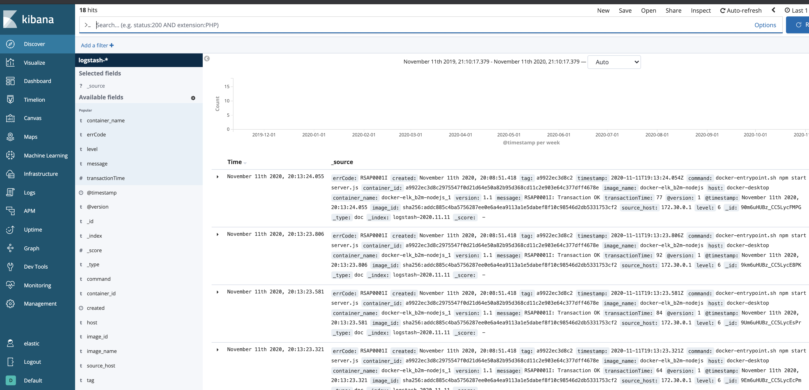
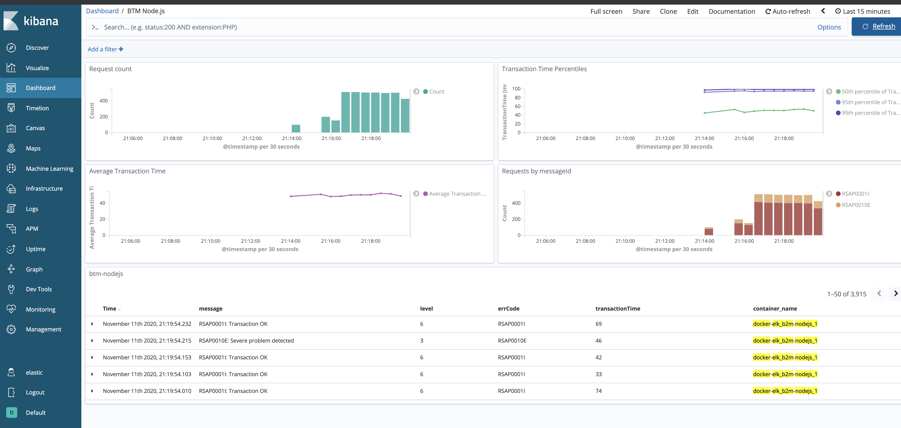

# Logging
- [Logging](#logging)
  - [Lab 1 - Node.js app logging with Elastic stack](#lab-1---nodejs-app-logging-with-elastic-stack)
    - [Deploy a local Elastic stack with Docker Compose](#deploy-a-local-elastic-stack-with-docker-compose)
    - [Instrument the Node.js app with logging](#instrument-the-nodejs-app-with-logging)
  - [Lab 2 - Node.js app logging with Humio](#lab-2---nodejs-app-logging-with-humio)
    - [Instrument the Node.js app with logging](#instrument-the-nodejs-app-with-logging-1)
    - [Deploy Humio with Docker Compose](#deploy-humio-with-docker-compose)
  

A production service should have both logging and monitoring. Monitoring provides a real-time and historical view on the system and application state, and alerts you in case a situation is met. In most cases, a monitoring alert is simply a trigger for you to start an investigation. Monitoring shows the symptoms of problems. Logs provide details and state on individual transactions, so you can fully understand the cause of problems.

Logs provide visibility into the behavior of a running app, they are one of the most fundamental tools for debugging and finding issues within your application. If structured correctly, logs can contain a wealth of information about a specific event. Logs can tell us not only when the event took place, but also provide us with details as to the root cause. Therefore, it is important that the log entries are readable to humans and machines. 

According to the [12-factor](https://12factor.net/) application guidelines, logs are the stream of aggregated, time-ordered events. A twelve-factor app never concerns itself with routing or storage of its output stream. It should not attempt to write to or manage log files. Instead, each running process writes its event stream, unbuffered, to stdout. If you deviate from these guidelines, make sure that you address the operational needs for log files, such as logging to local files and applying log rotation policies.

## Lab 1 - Node.js app logging with Elastic stack

### Deploy a local Elastic stack with Docker Compose

During this lab we will run the Elastic Stack (Elasticsearch, Logstash, Kibana) in docker-compose.
The ELK configuration in this lab is based on [https://github.com/deviantony/docker-elk](https://github.com/deviantony/docker-elk) (6.8.x branch).

Briefly review the simple Logstash configuration we will use for this lab: `docker-elk/logstash/pipeline/logstash.conf`:

```
input {
    gelf { port => 5000 }
}

filter {
    json { source => "message" }
    #we need level field in a numeric format
    mutate {
     gsub => [
      "level", "info", 6,
      "level", "error", 3
     ]
    }
    mutate {
     convert => { "level" => "integer" }
    }
}

output {
    elasticsearch {
        hosts => "elasticsearch:9200"
        user => "elastic"
        password => "changeme"
    }
    stdout { codec => rubydebug }
}
```

The above will configure Logstash input to use `gelf` (Graylog Extended Log Format) protocol supported by Docker log driver, so we can directly stream application logs from the app running in Docker container to Logstash using `gelf` protocol. JSON formatted app log message is extracted from the field `message` and parsed to named fields. After parsing and conversion the log steam is sent to elasticsearch.

1). Start the Elastic stack:
   
```
cd b2m-nodejs-v2/lab-1/docker-elk
docker-compose build
docker-compose up -d
```
>Note, it may take a while for the first time, because it will download the ELK images from DockerHub and build an image for our Node.js application.

2). While waiting for containers, review the configuration of our logging lab.
- `b2m-nodejs-v2/docker-elk/docker-compose.yaml` - this is the main config file for docker-compose stack which specifies all options for all containers in the stack.
- `b2m-nodejs-v2/lab-1/app/server.js` - the source code of our sample Node.js application.
- `b2m-nodejs-v2/lab-1/app/Dockerfile` - this file is used to build your app docker image.

3). After the `docker-compose` completed the startup, verify you can access Kibana on `http://localhost:5601`.

Logon using user: `elastic`, password: `changeme`

4). [Import](https://www.elastic.co/guide/en/kibana/6.8/managing-saved-objects.html) the index pattern, saved search, visualizations and dashboard from the provided `kibana.json` file. We will use them in the next part of the lab:
- Go to Management -> Kibana/Saved Objects -> Import and select the `b2m-nodejs-v2/kibana.json` file.

You should see the following Saved Objects imported:


### Instrument the Node.js app with logging

Now we will configure a logging library for our Node.js app and add some log statements that will be easy to consume by the ELK stack.

1). Go to the directory `b2m-nodejs-v2/lab-1/app` where the `server.js` file is located and add the following dependency to the `package.json`:

```
    "winston": "^3.2.1"
```
This will add [winston](https://www.npmjs.com/package/winston) logging library for node.js.

2). Add/uncomment the following line at the beginning of `server.js` to load the `winston` module:

```js
const { createLogger, format, transports } = require('winston')
```
then create/uncomment the `logger` object:

```js
const logger = createLogger({
  level: 'debug',
  format: format.combine(
    format.timestamp({
      format: "YYYY-MM-DD'T'HH:mm:ss.SSSZ"
    }),
    format.json()
  ),
  transports: [new transports.Console()]
});
```

The configuration above specifies timestamp field format and enables sending logs in `json` format to STDOUT.
Timestamp should include the time zone information and be precise down to milliseconds. 

Whenever you want to generate a log entry, just use the `logger` object with level specified methods: **error**, **warn**, **info**, **verbose**, **debug**

```js
msg = 'RSAP0010E: Severe problem detected'
logger.error(msg)
msg = 'RSAP0001I: Transaction OK'
logger.info(msg)
```

You can add also additional metadata like `errorCode` or `transactionTime` that can be useful in log analytics.

3). Add some logging statements as described below. Additional metadata will be used later in our log analytics dashboard. 

Look for commented lines starting with `logger` and uncomment them.

```js
msg = 'RSAP0001I: Transaction OK'
logger.info(msg, {"errCode": "RSAP0001I", "transactionTime": delay})

msg = 'RSAP0010E: Severe problem detected'
logger.error(msg, {"errorCode": "RSAP0010E", "transactionTime": delay})
```

After these changes the expected STDOUT is:

```json
{"errCode":"RSAP0001I","transactionTime":81,"level":"info","message":"RSAP0001I: Transaction OK","timestamp":"2019-02-27T07:34:49.625Z"}
{"errCode":"RSAP0010E","transactionTime":76,"level":"error","message":"RSAP0010E: Severe problem detected","timestamp":"2019-02-27T07:34:50.008Z"}
{"errCode":"RSAP0001I","transactionTime":22,"level":"info","message":"RSAP0001I: Transaction OK","timestamp":"2019-02-27T07:34:50.325Z"}
{"errCode":"RSAP0001I","transactionTime":1,"level":"info","message":"RSAP0001I: Transaction OK","timestamp":"2019-02-27T07:34:50.620Z"}
{"errCode":"RSAP0001I","transactionTime":96,"level":"info","message":"RSAP0001I: Transaction OK","timestamp":"2019-02-27T07:34:50.871Z"}
{"errCode":"RSAP0001I","transactionTime":62,"level":"info","message":"RSAP0001I: Transaction OK","timestamp":"2019-02-27T07:34:51.156Z"}
```

3). Rebuild the Node.js app contaner:

```
cd b2m-nodejs-v2/lab-1
docker-compose down
docker-compose build
docker-compose up -d
```

4). Simulate a couple of transactions using your web browser or `curl` by accessing `http://localhost:3001/checkout`:

```
for i in {1..10000}; do curl -w "\n" http://localhost:3001/checkout; done
```

and check out the Kibana (http://localhost:5601 elastic/changeme):
- The **Discover** view should be similar to:


- From the upper menu select `Open` and select the preconfigured saved search `btm-nodejs`:


- Access Dashboards -> `BTM Node.js`:




Kibana Dashboard is a collection of **Visualizations**. If you are interested in how these charts are configured, select the **Visualize** on the left menu, then select one of the Visualizations and check its configuration.

>**Stop the docker-compose stack before starting the next exercise:**

```
cd b2m-nodejs-v2/lab-1/docker-elk
docker-compose down -v
```

## Lab 2 - Node.js app logging with Humio

[Humio](humio.com) is purpose-built to help any organization achieve the benefits of large-scale logging and analysis. Humio has virtually no latency even at massive ingest volumes. And by using cloud-based bucket storage for all persistent data, retention is virtually infinite.
Humio aggregates, alerts, and visualizes streaming data in real time, so no matter what volume of data you send to Humio, data is processed instantly. This gives organizations live observability into the operations and health of their systems.
Indexing can be a very computationally-expensive activity, causing latency between data entering a system and then being included in search results and visualizations. Humio does no indexing, so it remains lightning fast with no compromise on performance.
Free-text search lets you search anything, in any field, without relying on pre-parsed fields. Schema on read allows you to extract data, define new fields, and use them to filter and aggregate as you search — all at blazing speeds.
Humio uses high data compression so you can cut hardware costs and store more data. High compression also makes it cost-effective to retain more data for longer, enabling both more detailed analysis and traceability over longer time periods.

More on https://www.humio.com/log-management#features

### Instrument the Node.js app with logging

If you did the Lab 1, you don't have to do anything - we will use exactly the same instrumentation, just copy and replace the `b2m-nodejs-v2/lab-1/app/server.js` to `b2m-nodejs-v2/lab-2/app/server.js`.

If you start with Lab 2, do the instrumentation steps with `winston` logging library as described in chapter [Instrument the Node.js app with logging](#instrument-the-nodejs-app-with-logging).


### Deploy Humio with Docker Compose

Start Humio with our Node.js app in docker-compose:

```
cd b2m-nodejs-v2/lab-2
./start-lab2.sh
```
>Note, it may take a while for the first time, because it will download the Humio image from DockerHub.

While waiting for containers, review the configuration of our logging lab.

- `b2m-nodejs-v2/lab-2/docker-compose.yaml` - this is the main config file for docker-compose stack which specifies all options for all containers in the stack.
- `b2m-nodejs-v2/lab-2/app/server.js` - the source code of our sample Node.js application instrumented with logging.
- `b2m-nodejs-v2/lab-2/app/Dockerfile` - this file is used to build your app docker image.

Access the Humio UI using internet browser on http://localhost:8080
Click `Add item` and create `b2m-nodejs` repository.
Click on the new repository link and go to `Settings -> API Tokens`. Copy the default token.

Stop the Humio stack:
```
cd b2m-nodejs-v2/lab-2
docker-compose down
```

Edit the `b2m-nodejs-v2/lab-2/docker-compose.yaml` and paste the token as value of `splunk-token` (remember to put the token in quotes).
Uncomment the whole `b2m-nodejs` section (together with all its options).

Start the Humio and Node.js stack:

```
cd b2m-nodejs-v2/lab-2
./start-lab2.sh
```
Access the Humio UI using internet browser on http://localhost:8080

Go to `b2m-nodejs` repository and select `Parsers`:

Click on `+ New Parser`. Name it `b2m-json`.

Paste the following Parser script:

```
parseJson()|parseJson(line)
```
Why we parse JSON twice? Docker wraps the application log (which we emit as JSON) in its own JSON envelope, so first we parse docker JSON and then pare JSON contents of already extracted field `line`. Note the cool `|` characted which works exactly the same way as in Linux or Unix shell.

On the right side of the Parsers editor you can test your parser. Paste this line:

```
{"line":"{\"errCode\":\"RSAP0001I\",\"transactionTime\":43,\"level\":\"info\",\"message\":\"RSAP0001I: Transaction OK\",\"timestamp\":\"2020-11-11T22:35:20.949Z\"}","source":"stdout","tag":"ee4799aa3c53"}
```
and verify extracted fileds.

Save your new Parser.

Go to Settings->API tokens and select your newly defined parse in the `Assigned Parser` option of the `default` API token.

Simulate a couple of transactions using your web browser or `curl` by accessing http://localhost:3001/checkout:

```
for i in {1..10000}; do curl -w "\n" http://localhost:3001/checkout; done
```

Verify results in the Search view.

Import the Humio dashboard provided with this lab `humio-dashboard.yaml`:
- Go to `Dashboards`, click `+ New Dashboard`
- Select `Template file` Option and name it `B2M Node.js`
- Click `Upload Template` and select `b2m-nodejs-v2/lab-2/humio-dashboard.yaml`
- Click `Create Dashboard`

Access `B2M Node.js` dashboard. Generate more application requests with:

```
for i in {1..10000}; do curl -w "\n" http://localhost:3001/checkout; done
```

